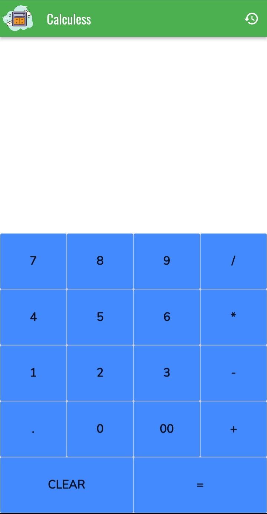
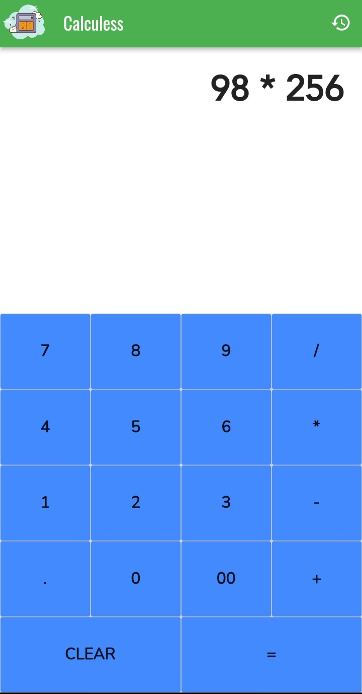
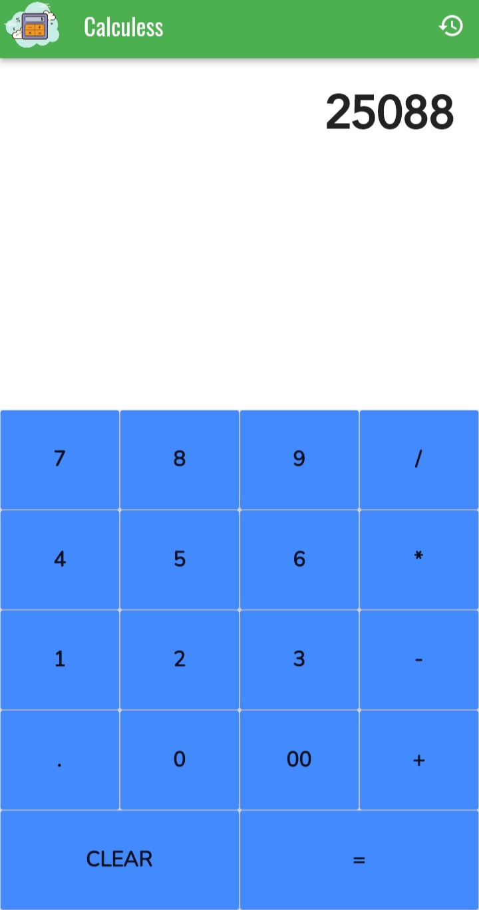
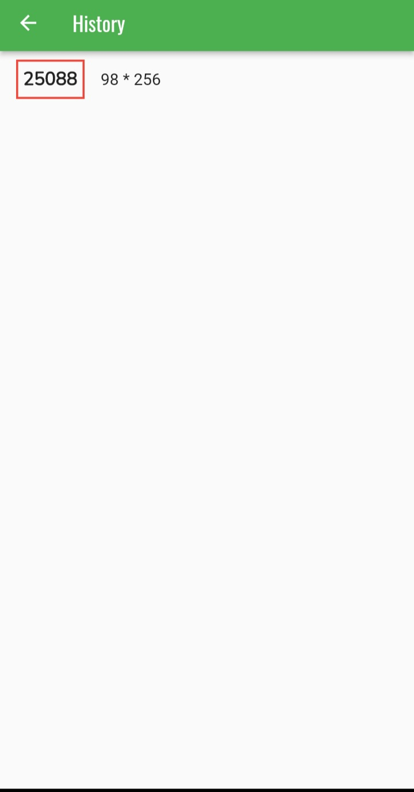

# Project Explanation🚀
It is a simple cross-platform calculator app made on Flutter. 
  
# Tech - Stack 👨‍💻👩‍💻
 Flutter (Version used during development: 3.0.5)

## Features 
Has a history feature to see recent calculations  

## App Build
Apk Builds can be found <a href="https://drive.google.com/drive/folders/1UbuUAy4mRQCjHda-Qhqi-T68upuLZ-Nv?usp=sharing">here</a> app.apk should work for most phones.

## Screenshots
<table>
  <tr>
    <td></td>
    <td></td>
    <td></td>
    <td></td>
  </tr>
 </table>
 
## Usage
1.Clone the repository  
2.Get Packages by running
    ```
    flutter pub get 
    ```  
3.Run the project on emulator or on a physical device!
