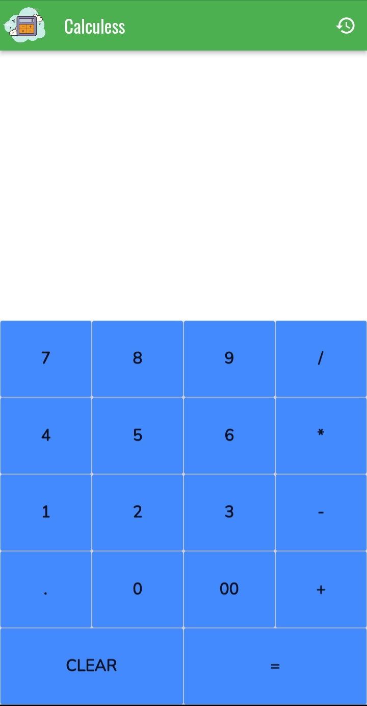
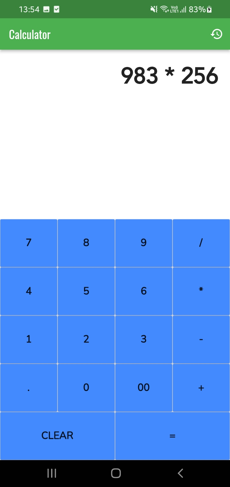
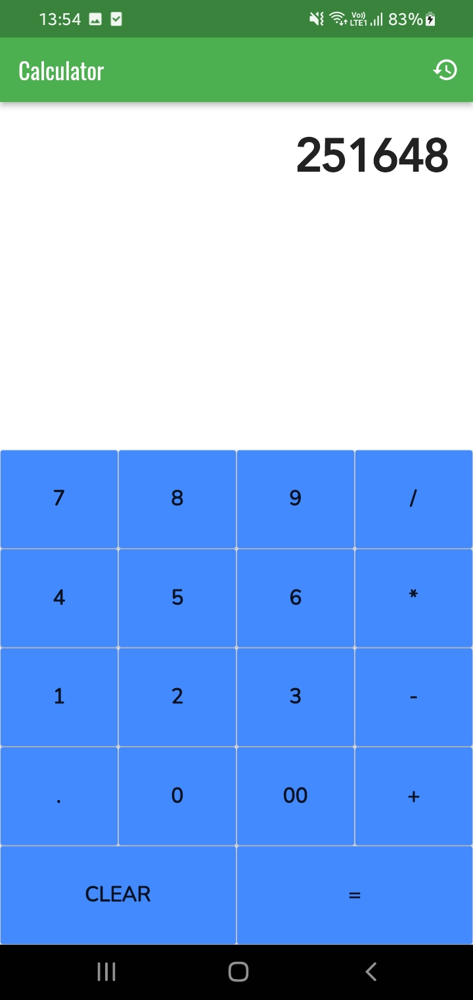
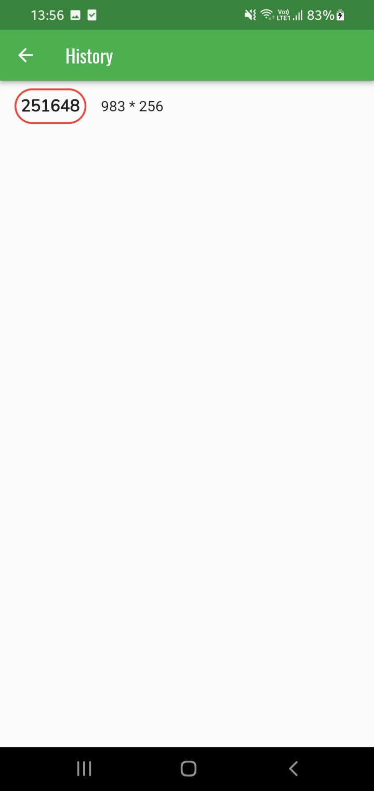

# Project Explanation🚀
It is a simple cross-platform calculator app made on Flutter. 
  
# Tech - Stack 👨‍💻👩‍💻
 Flutter (Version used during development: 3.0.5)

## Extra features 
Has a History feature to see recent calculations  

## Screenshots


## Usage
1.Clone the repository  
2.Get Packages by running
    ```
    flutter pub get 
    ```  
3.Run the project on emulator or on a physical device!
